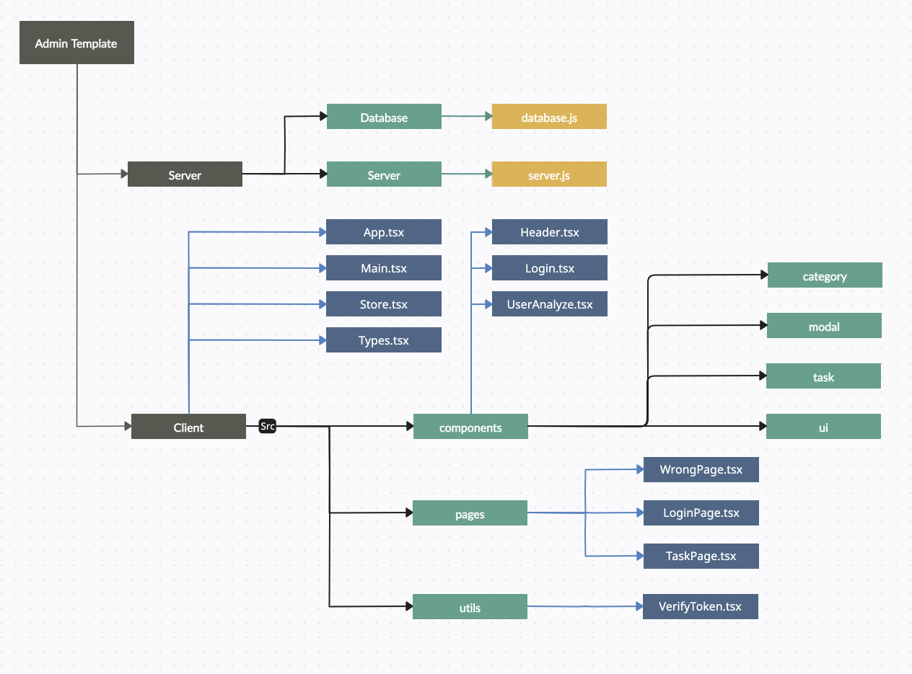

<h3 align="center">Admin 페이지 구현 프로젝트</h2>

  
  

  
  
  

### 프로젝트 목적

`OAuth`를 통해 일반적인 회원가입 / 로그인을 지원하는 간단한 태스크매니저 프로젝트입니다.

데이터베이스`Mysql`을 이용해 서버단과 직접 통신하고 `CRUD`을 구현했습니다.

Dark Theme, Modal등 간단한 사용자 친화적인 기능을 추가하였습니다.

 

### 기술스택 사용목적

-   `TypeScript`를 직접적으로 연습해보고자 도입 했습니다.
-   `mySql`과 효율적인 통신을 위해 `Docker`를 활용하여 구현 하였습니다.
-   `Global State`를 통한 상태관리에 익숙해지기위해 `Zustand`를 도입하여 사용 했습니다.
-   간단한 테마 지원과 빠른 스타일링 작성을 위해 `Tailwind CSS`를 도입하여 사용 했습니다.
-   `Token Verify`등 간단한 사용자 정보 비동기관리를 위해 `React-query`를 도입하여 사용 했습니다.

 

### 디렉터리 구조

### 기능별 구현 과정

[서버 구현](./docs/server.md)  
[회원가입 구현](./docs/register.md)  
[로그인 구현](./docs/login.md)  
[검증 구현](./docs/verify.md)  
[태스크 페이지 구현](./docs/task.md)  
[어드민 페이지 구현](./docs/admin.md)  
